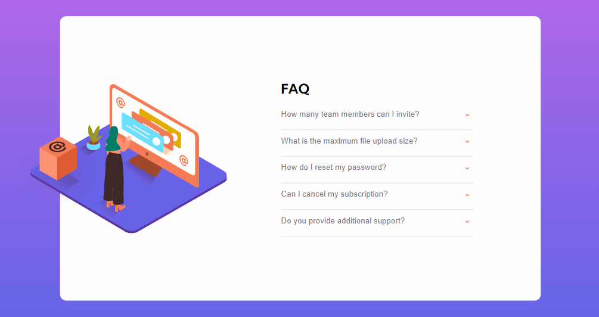

# Desafio FAQ - Frontend-Mentor

Este é um desafio de uma página de FAQ proposto pelo site Frontend-Mentor.

## Tabela de Conteúdos

- [Visão Geral](#visão-geral)
    - [Imagens](#imagens)
    - [Link da página](#link)
- [Processo](#processo)
    - [Linguagens utilizadas](#linguagens-utilizadas)
    - [O que aprendi](#o-que-aprendi)
    - [Possíveis evoluções](#possíveis-evoluções)
- [Autor](#autor)

## Visão-geral

### Imagens

<br>

````
Versão de Desktop
````

   

<br>

````
Versão Mobile
````

 

### Link

- Página no GitHub Pages: <a href="https://julio-mansan2.github.io/faq/">Clique aqui!</a>

## Processo

### Linguagens utilizadas

<br>

- Marcações semânticas de HTML5
- Propriedades de customização do CSS3
- Estruturas de JavaScript

<br>

### O que aprendi

<br>

- Ocultar imagens não semânticas, em caso de erro:

````html


````

- Criar um menu acordeon:

````html

<button class="acordeon">How many team members can I invite?</button>
<div class="info">
    <p>You can invite up to 2 additional users on the Free plan. There is no limit on team members for the Premium plan.</p>
</div>
<hr>

<button class="acordeon">What is the maximum file upload size?</button>
<div class="info">
<p>No more than 2GB. All files in your account must fit your allotted storage space.</p>
</div>
<hr>

````

````css

.acordeon {
    margin: 15px 0;
    transition: 0.3s ease-in-out;
    font: 400 1.2rem 'Kummbh Sans', sans-serif;
    color: hsl(240, 6%, 50%);
}

.acordeon::after {
    content: url(../images/icon-arrow-down.svg);
    position: absolute;
    right: 20%;
}

.active::after {
    transform: rotate(180deg);
}

.active.acordeon {
    font-weight: 700;
    color: hsl(238, 29%, 16%);
}

.acordeon:hover {
    color: hsl(14, 88%, 65%);
    cursor: pointer;
}

.info {
    font-size: 15px;
    margin-bottom: 10px;
    overflow: hidden;
    max-height: 0;
    transition: max-height 0.2s ease-out;
}

````
- Estilizar o input radio de forma visualmente agradável:

````css

.radio {
    height: 4.4rem;
    position: relative;
    width: 4.4rem;
  }
  
.radio + .radio {
    margin-left: 1.5rem;
}
  
.radio label {
    background: var(--dark);
    cursor: pointer;
    display: flex;
    justify-content: center;
    align-items: center;
    position: absolute;
    width: 100%;
    height: 100%;
    border-radius: 100%;
}
  
.radio label span {
    z-index: 1;
    color: var(--white);
    font-weight: 700;
}
  
.radio label input[type=radio] {
    all: unset;
    position: absolute;
    width: 100%;
    height: 100%;
    top: 0;
    left: 0;
    transition: 0.3s;
    border-radius: 70%;
  }
  
.radio label input[type=radio]:checked {
    background-color: var(--light-grey);
}

.radio label input[type=radio]:hover {
    background-color: var(--orange);
}

````
````javascript

var acc = document.getElementsByClassName("acordeon");
var i;

for (i = 0; i < acc.length; i++) {
  acc[i].addEventListener("click", function() {
    this.classList.toggle("active");
    var panel = this.nextElementSibling;
    if (panel.style.maxHeight) {
      panel.style.maxHeight = null;
    } else {
      panel.style.maxHeight = panel.scrollHeight + "px";
    } 
  });
}

````
<br>

### Possíveis evoluções

<br>

- Códigos mais compactos;
- Utilizar menor quantidade de media-querries.

<br>

## Autor

GitHub - <a href="https://github.com/julio-mansan2">julio-mansan2</a> <br>
Front-end Mentor - <a href="https://www.frontendmentor.io/profile/julio-mansan2">julio-mansan2</a> <br>
LinkedIn - <a href="https://www.linkedin.com/in/j%C3%BAlio-a-mansan-3415a7249/">Júlio A.</a> <br>